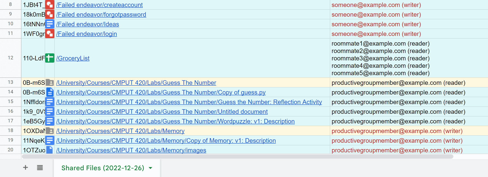

<!-- Project Header -->

  

  <h1 class="projectName">Shared File Finder for Google Drive</h1>

  

    
    
    
    
  

  

    An Apps Script that finds all files/folders on Google Drive that are shared with others and adds them to a Google Sheet.
  

   

## 👋 About
An [Apps Script](https://developers.google.com/apps-script) that finds all files/folders on [Google Drive](https://drive.google.com) that are shared with others and adds them to a Google Sheet.

## 🕹️ Usage
 1. Create a [new Google Sheet](https://docs.google.com/spreadsheets/create)
 2. Open the Script Editor (Extensions > Apps Script)
 3. Copy and paste the code from [shared-file-finder.js](shared-file-finder.js) into the Script Editor
 4. Enable `Drive API` in the `Advanced Services` list for the project (see [here](https://developers.google.com/apps-script/guides/services/advanced#enable_advanced_services) for instructions). The API version should be v2 and the identifier should be `Drive`
 5. Save the project and run the `runSharedFileFinder()` function

**Notes:**
  - Files must be owned by the current Google Drive user
  - If a folder is shared, both the folder and its files will be shown in the list
  - There may be bugs. Use at your own risk

## 🤝 Contributing
Contributions, issues, and forks are welcome.

## 🧾 License
Inspired by similar scripts by [@danjargold] and [@woodwardtw] (linked below). This version uses the Drive API v2 to get info for multiple files at once which makes it substantially faster.

This project is licensed under the MIT License. See [LICENSE](LICENSE) for details.

## 🖇️ Related
- **[tellmeyoursecrets.js](https://gist.github.com/woodwardtw/22a199ecca73ff15a0eb)**: An Apps script by [@woodwardtw] that lists info about the files in a particular folder/sub folder structure including viewers, editors, and sharing permissions. Note that this script does not find files recursively (ie. it shows a list of the shared items inside the specified folder and its subfolders, but not items contained in nested subfolders)
- **[whatFilesHaveIShared.gs](https://gist.github.com/danjargold/c6542e68fe3a3b46eeb0172f914641bc)**: An improved fork of the above script by [@danjargold] that finds files recursively
- **[Tally](https://tally.johng.io)**: Your favorite word counter, now with a dark mode! Count the number of characters, words, sentences, paragraphs, and lines in your text instantly
- **[Mergist](https://mergist.johng.io)**: Mergist is an online tool to combine multiple PDF files into one. Mergist has no ads, no file size limits, and your files never leave your device

## 💕 Funding

Find this project useful? [Sponsoring me](https://johng.io/funding) will help me cover costs and **_commit_** more time to open-source.

If you can't donate but still want to contribute, don't worry. There are many other ways to help out, like:

- 📢 reporting (submitting feature requests & bug reports)
- 👨‍💻 coding (implementing features & fixing bugs)
- 📝 writing (documenting & translating)
- 💬 spreading the word
- ⭐ starring the project

I appreciate the support!

[@woodwardtw]: https://gist.github.com/woodwardtw
[@danjargold]: https://gist.github.com/danjargold
